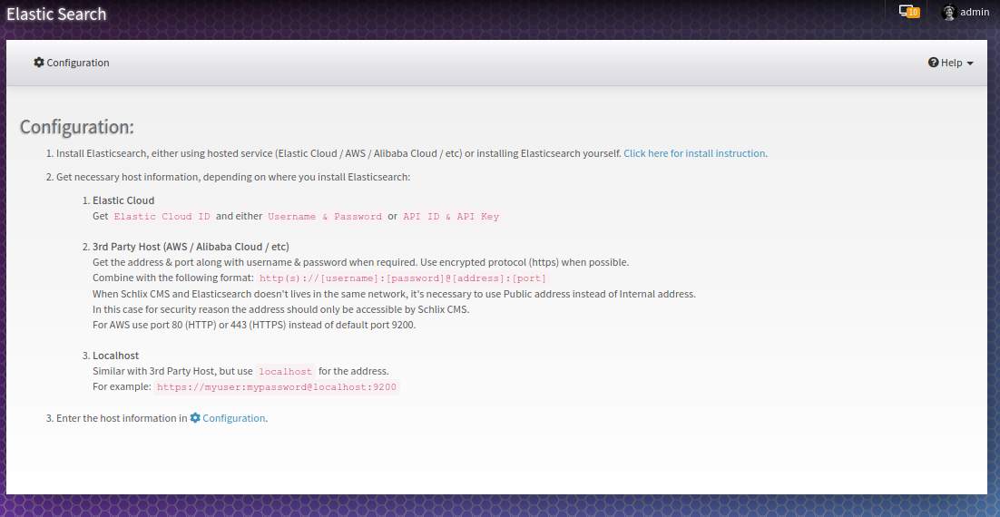
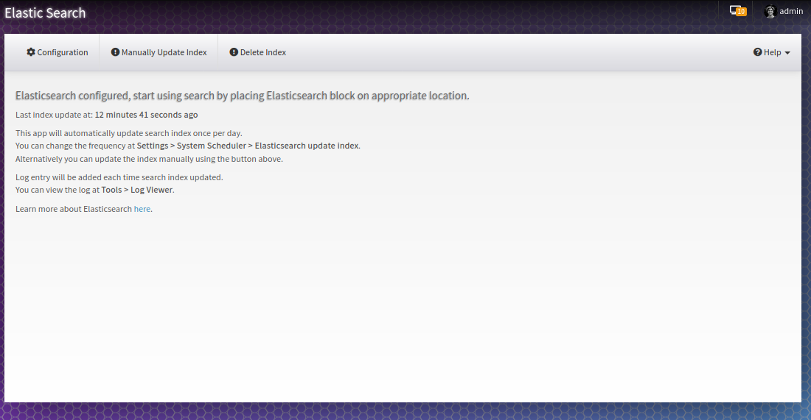
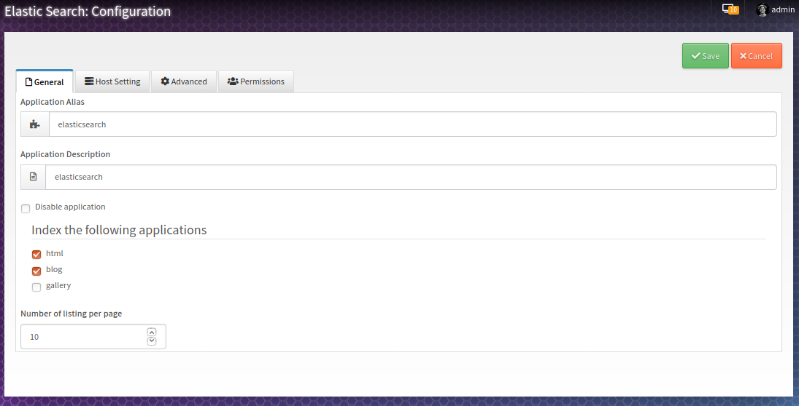
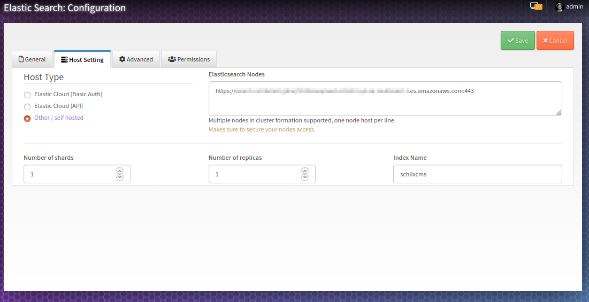
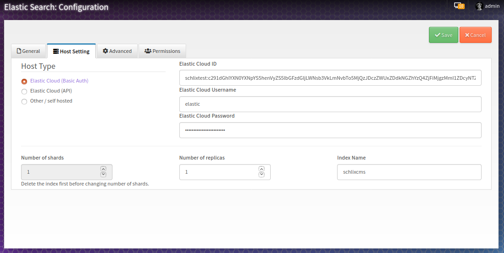
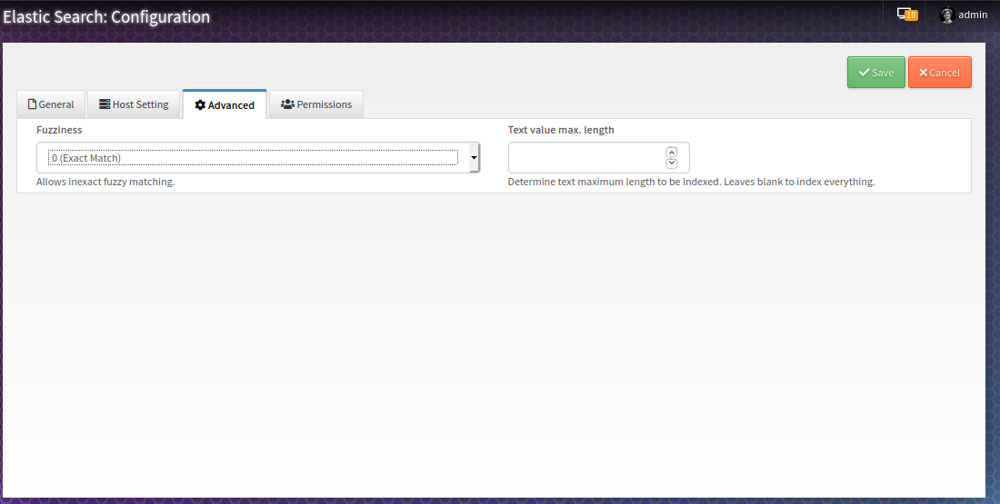

# Elasticsearch for SCHLIX CMS
Search alternative for [SCHLIX CMS](https://www.schlix.com) backed by [Elasticsearch](https://www.elastic.co/guide/en/elasticsearch/reference/7.5/elasticsearch-intro.html).

## Features

- Simple to setup.
- Supports Elastic Cloud hosted or any 3rd Party hosts.
- Search across all blog and web pages, and optionally gallery.
- Index auto-updated by SCHLIX Scheduler, once per day.
- Weighted search results, matched title get the highest priority.
- Fuzzy search.
- Paginated results.
- Search filtered by user groups (v1.2+).
- Missing features? Create an issue or even better a pull request..

## Screenshots

#### Search result page

#### Admin page

## License

[MIT](http://opensource.org/licenses/MIT)
