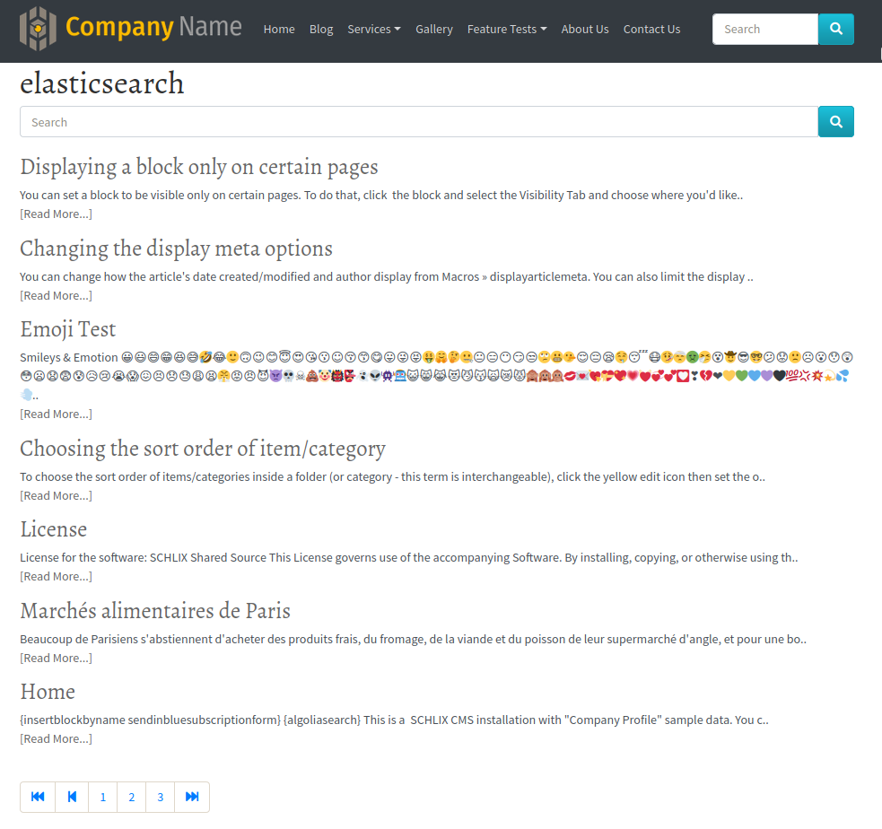
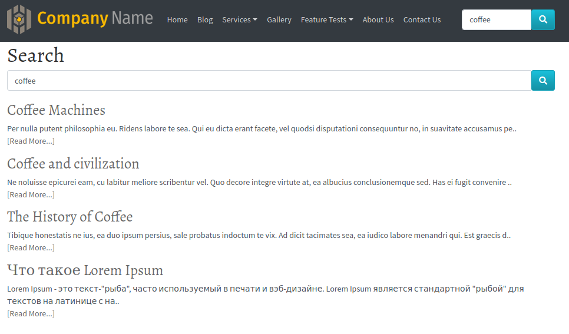
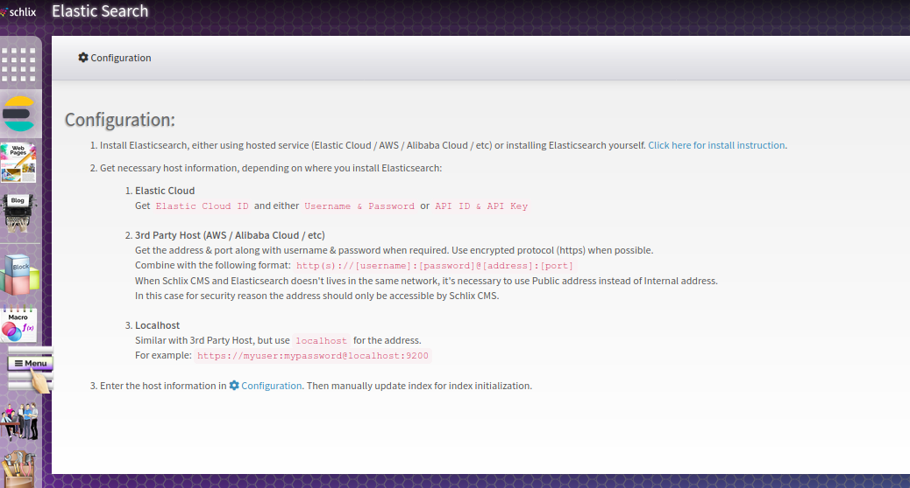

# Elasticsearch for SCHLIX CMS
Search alternative for [SCHLIX CMS](https://www.schlix.com) backed by [Elasticsearch](https://www.elastic.co/guide/en/elasticsearch/reference/7.5/elasticsearch-intro.html).

## Screenshots

#### Search result page

#### Admin page

## License

[MIT](http://opensource.org/licenses/MIT)
